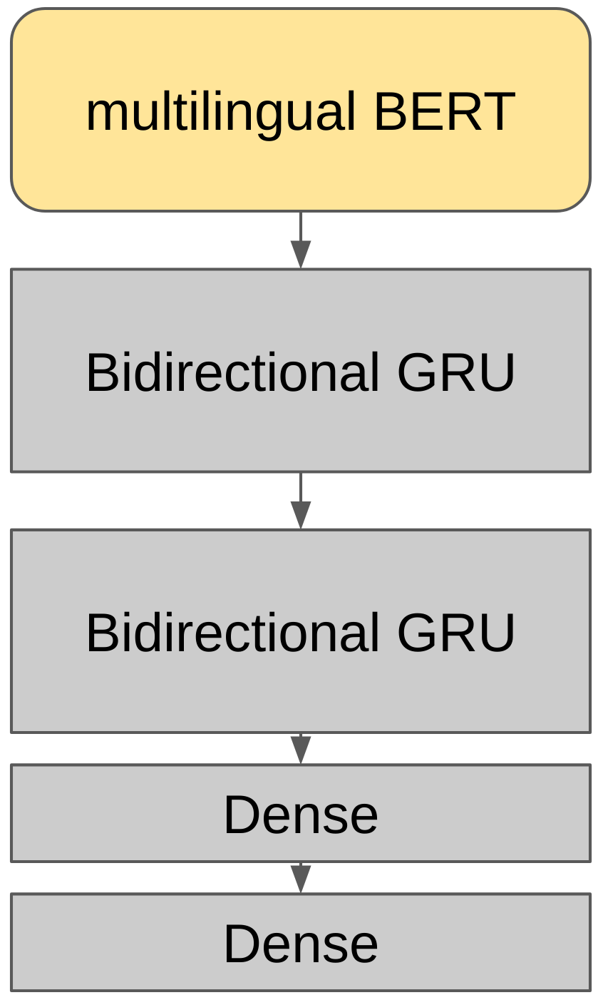
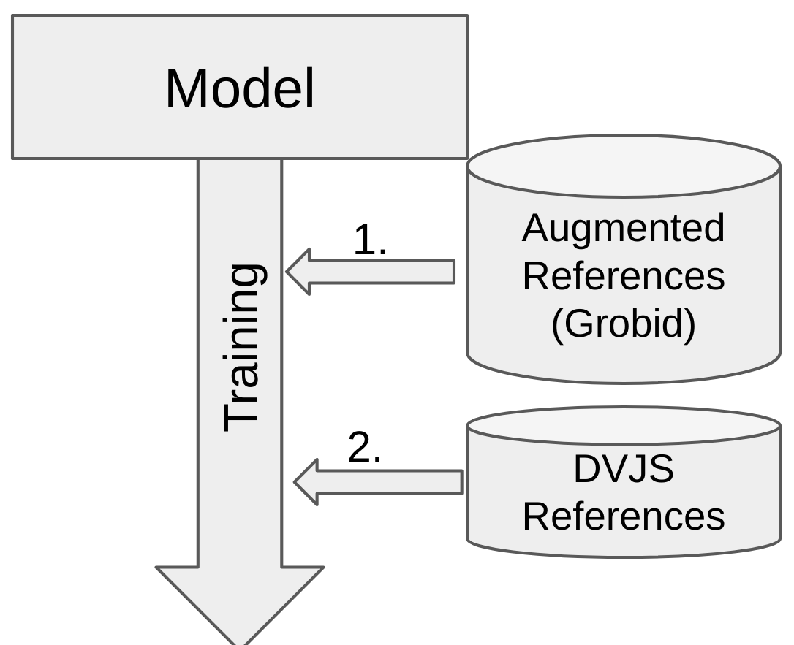

# Bibliographic Reference Parser for German Humanities Journals
## Model

The model consists of two bidirectional GRUs and two dense layers. The first GRU receives the output of the last layer of a multilingual BERT model as input.
It is not sufficient to use a German BERT model, because it cannot be adapted to the mostly English data from the <a href="https://github.com/kermitt2/grobid">GROBID</a> project. The Multilingual Model on the other hand can be trained on both English and German data and achieves better results in combination.

## Training

The training has a two-stage structure. First, training is based on the gold data from the <a href="https://github.com/kermitt2/grobid">GROBID</a> project. These will be adapted beforehand so that they are more similar to humanities references (6817 References, gold/grobid_hum.tsv). For this purpose, typical markers such as "vgl." or "siehe dazu" are inserted or the reference is completely embedded in continuous text and divided into segments. The second training step then uses labelled data (341 References) from the <i>Deutsche Vierteljahreszeitschrift für Literaturwissenschaft und Geistesgeschichte (DVJS)</i>. More details about the training can be found in the script (code/train_model.py)

## Usage
